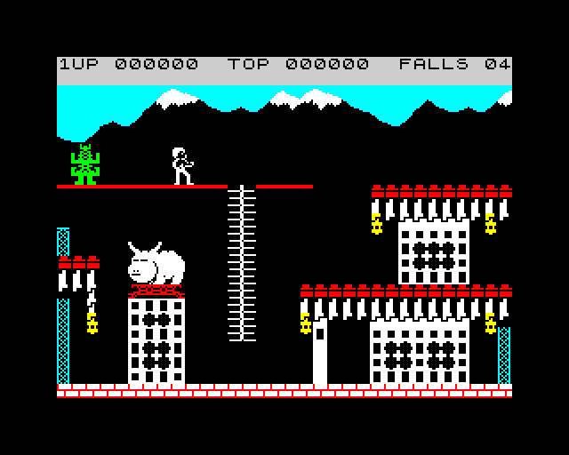
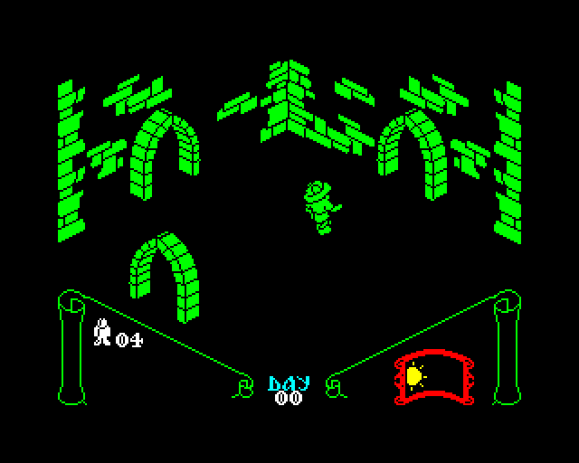

Timex.Emu
========

Timex.Emu is an emulator for the Timex 2048 — the author's first computer. The shared Z80 / tape / screen / keyboard modules also power a sibling ZX Spectrum 128 machine (see *ZX Spectrum 128 support* below).

Folder structure:

docs:
  - Z80 CPU Manual
  - Z80 CPU Peripherals
  - Complete ROM

python:
  - `timex.py` — entry for the Timex 2048 (calls `emulate.py --machine=timex2048`).
  - `emulate.py` — shared entry point; accepts `--machine=<name>` to pick a target (default `timex2048`, also `spectrum128`). All flags below work with either entry unless noted.
  - `machines/` — per-machine wiring (`timex2048.py`, `spectrum128.py`).

  Example command to load a user program:

  `python3 timex.py --program=helloworld.bin --startAt=8000 --breakAt=8000 --mapAt=8000 --hook-system`

  This loads user program `helloworld.bin` (`--program`) at `0x8000` (`--mapAt`), putting a break point at `0x8000` (`--breakAt`) and starting execution from `0x8000` too (`--startAt`). Additionally system function (i.e. `print`) are being hooked with python replacement.

  To run with display (requires pygame-ce):

  `python3 timex.py`

  To run without display:

  `python3 timex.py --no-display`

  Keyboard mapping (PC → Timex 2048):

  | PC Key | Timex 2048 |
  |--------|------------|
  | A-Z, 0-9 | Same |
  | Enter | ENTER |
  | Space | SPACE |
  | Left/Right Shift | CAPS SHIFT |
  | Left/Right Ctrl | SYMBOL SHIFT |

  Common combinations:
  - `Shift + 0` — DELETE (backspace)
  - `Ctrl + P` — " (double quote)
  - `Ctrl + Z` — : (colon)
  - `Ctrl + N` — , (comma)
  - `Ctrl + Symbol` — ; (semicolon)

  BASIC input modes:
  - **K mode** (cursor shows `K`) — default after ENTER. Single keypress gives keywords (e.g. `P` = PRINT, `G` = GOTO). Switches to L mode after first keyword.
  - **L mode** (cursor shows `L`) — lowercase letter input. Entered automatically after typing a keyword in K mode.
  - **C mode** (cursor shows `C`) — uppercase letters. Toggle with CAPS LOCK (`Shift + 2`).
  - **E mode** (cursor shows `E`) — extended keywords. Enter by pressing `Shift + Ctrl` together. Then press a key (with or without `Ctrl`) to get extended keywords like BEEP, INK, PAPER, etc.
  - **G mode** (cursor shows `G`) — graphics characters. Enter with `Shift + 9`.

  Emulator keys:
  - `F1` — pause / resume
  - `F2` — open interactive debugger (in terminal)
  - `F5` — soft reset (clears RAM, reloads ROM, rewinds tape)
  - `F6` — tape play/stop (for multi-load games)
  - `F8` — save state to .z80 file (load back with `--z80=state_xxxx.z80`)
  - `F11` — toggle CRT scanline filter
  - `F12` — save screenshot as PNG
  - `Tab` (hold) — turbo mode (fast-forward)
  - `Backspace` (hold) — rewind time (~50 seconds buffer)
  - `Arrow keys` — Kempston joystick directions
  - `Right Alt` — Kempston joystick fire

  Example — typing `BEEP 1,0`:
  1. Make sure you're in K mode (press ENTER if needed)
  2. `Shift + Ctrl` (enter E mode)
  3. `Ctrl + Z` (BEEP keyword)
  4. `Space`, `1`, `Ctrl + N` (comma), `0`
  5. `Enter` (execute)

  Loading games from .tap files:

  `python3 timex.py --tape=game.tap`

  Then type `LOAD ""` (press `J` then `Ctrl+P` twice) and press `Enter`.

  Loading .z80 snapshots (instant, no LOAD needed):

  `python3 timex.py --z80=game.z80`

  Additional options:
  - `--scale=3` — scale display (default 2x, use 3 or 4 for hi-res monitors)
  - `--debug` — enable periodic PC/register logging to terminal
  - `--no-display` — run headless (no pygame window)
  - `--attach-logger` — attach the instruction logger at startup
  - `--tape-mode=trap|pulse` — tape emulation strategy. `trap` (default) intercepts the ROM `LD-BYTES` routine and injects blocks instantly. `pulse` streams T-state-accurate EAR edges on port `0xFE` bit 6, loads in real time, and is the mode needed by turbo / custom loaders (e.g. multi-load games).

  Sound: the ULA beeper (port `0xFE` bit 4) is emulated and mixed to audio output via pygame — BEEP commands and in-game effects are audible.

  Debugger commands (press F2 to enter):
  | Command | Description |
  |---------|-------------|
  | `ir` | 8-bit registers |
  | `ir16` | 16-bit registers |
  | `if` | CPU flags |
  | `d [0xADDR]` | disassemble at address (default: PC) |
  | `m 0xADDR` | hex dump memory |
  | `pram 0xADDR` | print single byte from RAM |
  | `b 0xADDR` | set breakpoint |
  | `bc 0xADDR` | clear breakpoint |
  | `bd 0xADDR` | disable breakpoint (keep but skip) |
  | `bl` | list breakpoints |
  | `s` | single step |
  | `n` | step over (skip into CALL/RST) |
  | `c` | continue |
  | `t` | print timing info (m-cycles, t-states) |
  | `trace on/off` | enable/disable execution trace |
  | `trace [n]` | show last n executed instructions |
  | `stack [n]` | show stack entries (default 8) |
  | `log` | attach/detach instruction logger |
  | `?` | debugger help |
  | `q` / `exit` | quit |

rom:
  - Binary file containing ROM of actual machine

tests:
  - a suite of unit tests
    - running tests: `python3 -m unittest discover`.

  > [!NOTE]
  > To run zexall or zexdoc tests suite set ZEXALL or ZEXDOC environment variable to True respectivly
  >
  > `export ZEXALL=True`
  >
  > `python3 -m unittest tests_cpu.tests_cpu.test_zexall`
  > `python3 -m unittest tests_cpu.tests_cpu.test_zexdoc`

ZX Spectrum 128 support
=======================

The emulator also runs as a ZX Spectrum 128 (sometimes called "Spectrum 128K" or, with Amstrad's +2, the grey-case machine). Most of the codebase is machine-agnostic — the CPU, screen rendering, keyboard, tape, and snapshot loader are shared. A dedicated `Spectrum128Machine` adds banked memory (8 × 16K RAM pages + 2 × 16K ROM banks), port `0x7FFD` paging, and the 3.5469 MHz frame timing.

Launching:

`python3 emulate.py --machine=spectrum128 --scale=3`

ROM layout — drop the 128K ROM at `rom/128.rom`, either as:
  - a single **32K** file (bank 0 first = editor/menu ROM, bank 1 second = 48K BASIC), or
  - a **16K** file for bank 0 only; in that case a sibling `rom/128.1.rom` is loaded as bank 1 if present.

The standard Sinclair 128K ROM and the Amstrad +2 ROM both work. The +2A/+3 (black case, four ROMs + extra port `0x1FFD`) is not supported.

Menu navigation (the "128 BASIC / Calculator / Tape Loader / Tape Tester / 48 BASIC" screen):
  - `Shift + 7` — cursor up
  - `Shift + 6` — cursor down
  - `Enter` — select

Loading games:
  - `.tap` files work the same as on Timex (`--tape=... --tape-mode=pulse` for custom loaders).
  - `.z80` snapshots of 128K games work via `--z80=<file>`. The loader detects 128K hardware (v2 hw=3|4, v3 hw=4|5|6), fans pages into the right banks, and applies the port `0x7FFD` latch from byte 35.

Current status:
  - Boots to the 128 menu, 128 BASIC, and 48 BASIC.
  - Runs 128K snapshots (e.g. *Commando*).
  - AY-3-8912 sound chip is not yet implemented — games that rely on it for music/SFX will be silent; the beeper still works.
  - `F8` state saving is a no-op on Spectrum 128 for now (no 128K .z80 writer yet).

Screenshots
===========

Screenshots from games running in the emulator. Press `F12` in-emulator to save a PNG (written to the current working directory as `screenshot_<frame>.png`); move captures into `screenshots/` and reference them below.

| Game | Screenshot |
|------|------------|
| Bruce Lee |  |
| Knight Lore |  |
| Bomb Jack |  |

Links
=====
  - [http://pl.wikipedia.org/wiki/Zilog_Z80](http://pl.wikipedia.org/wiki/Zilog_Z80)
  - [http://pl.wikipedia.org/wiki/Timex_Sinclair_2048](http://pl.wikipedia.org/wiki/Timex_Sinclair_2048)
  - [http://en.wikipedia.org/wiki/Timex_Computer_2048](http://en.wikipedia.org/wiki/Timex_Computer_2048)
  - [https://en.wikipedia.org/wiki/ZX_Spectrum#128K_models](https://en.wikipedia.org/wiki/ZX_Spectrum#128K_models)
  - [http://clrhome.org/table/](http://clrhome.org/table/)

